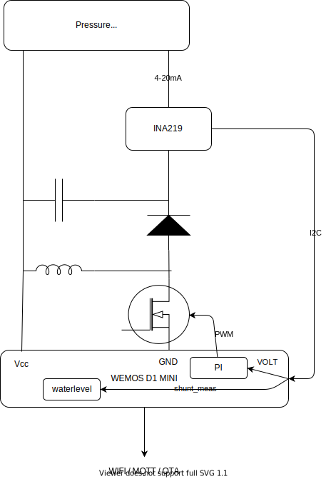
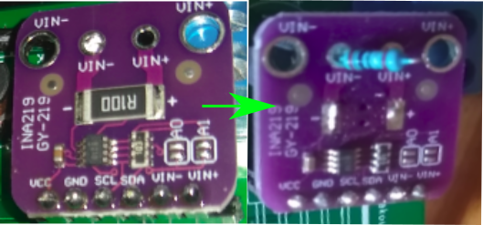
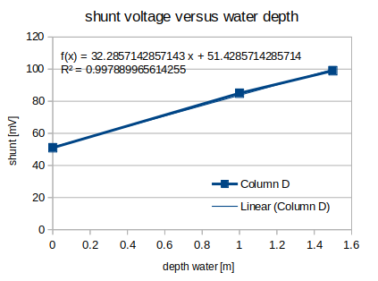
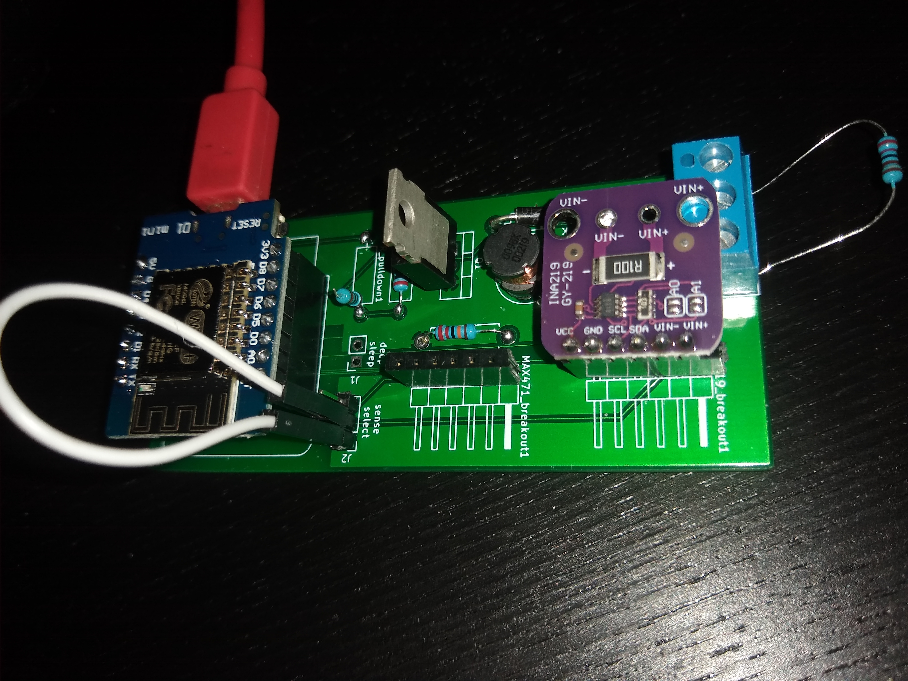
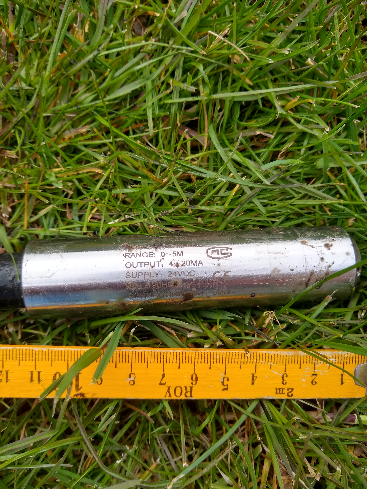
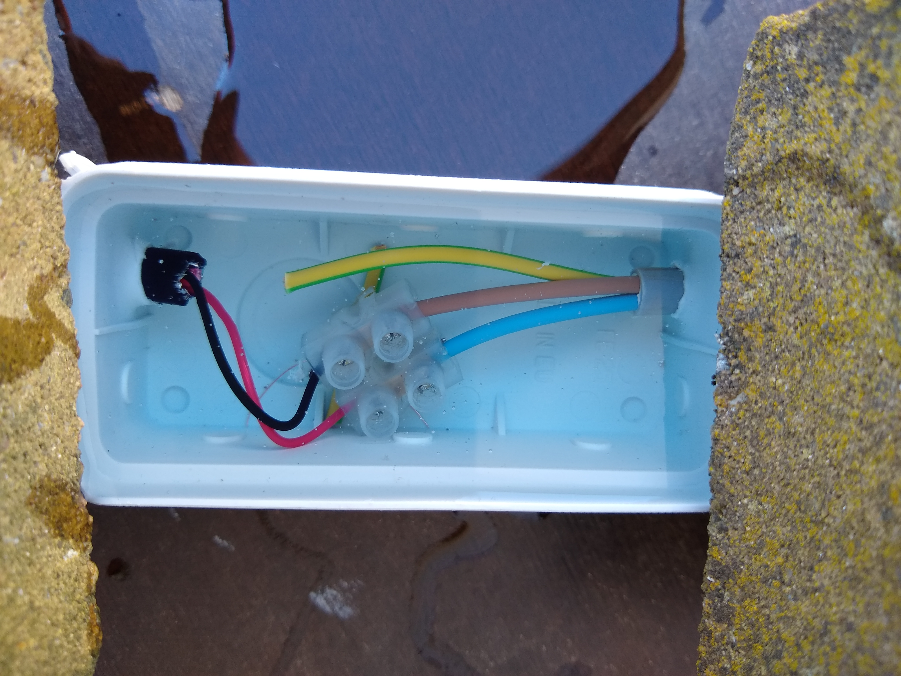

# WaterLevelDetection

- [WaterLevelDetection](#waterleveldetection)
  * [Goal](#goal)
  * [Wishlist](#wishlist)
  * [Concept and used components](#concept-and-used-components)
    + [Controller](#controller)
    + [Pressure sensing and power electronics](#pressure-sensing-and-power-electronics)
  * [Implementation](#implementation)
    + [List of components](#list-of-components)
    + [Power electronics](#power-electronics)
    + [Current measurement](#current-measurement)
  * [Calibration](#calibration)
  * [Pictures](#pictures)
  * [Home assistant integration](#home-assistant-integration)
  * [(Possible) next steps](#-possible--next-steps)


## Goal

Measure the level of available water in a rainwater well and report in a home automation tool (here home assitant).

Spoiler alert: a 4-20mA, 24V converter using an ESP8266 was created for this.

## Wishlist

- Report level of water depth over WiFi (mqtt messages) 
- Since waterlevel only needs to be measured every x hours or days, use a deepsleep method to safe power and prevent heating / wear of components
- Use common components (through hole components for electronics, no SMD, ... )
- Be able to update software over the air

## Concept and used components

The measuring principle is based on water pressure, the pressure at the bottom of the well is proportional with the height of the water. Other methods using distance sensors sound quite unreliable (reflections, need to have a wide cone of free air to measure to the bottom of the well, ... ) or cumbersome (capacitive sensing).

### Controller
To take care of the Wifi and mqtt messages, an ESP8266 ([Wemos D1 mini](https://www.banggood.com/Geekcreit-D1-mini-V2_2_0-WIFI-Internet-Development-Board-Based-ESP8266-4MB-FLASH-ESP-12S-Chip-p-1143874.html?cur_warehouse=CN&rmmds=search&p=ET150713234951201708&custlinkid=1551683)) is used.

### Pressure sensing and power electronics
The sensor used here: [Pressure sensor](https://www.banggood.com/Submersible-Water-Level-Transmitter-Level-Transducer-Sensor-0-5mH2O-6m-Cable-p-1146896.html?rmmds=myorder&cur_warehouse=CN&p=ET150713234951201708&custlinkid=1551677).

This sensor creates an additional challenge, it returns a current between 4-20mA - proportional with the pressure - and requires a 24V supply voltage. 

- To measure the 4-20 mA, an INA219 sensor is used. This is a high side current sensor and additionally measures the bus voltage. This voltage will be used later to generate a reliable supply voltage.
- I was not able to identify a boost DC-DC converter that was through-hole (not SMD) and had an enable/disable pin. So I've decided to create a small dc-converter myself. It's important to use an N-channel mosfet which can be switched by a 3.3V signal from the ESP8266. All the rest (diode, inductor, capacitor) are quite standard components which you can find cheaply.
Other attempts made with breakoutboards using MT3608's, didn't really produce a stable output voltage when  component temperature got warmer etc.

## Implementation

Only the conceptual implementation is explained here, the source files contain the details.
<!--  -->


<!--  -->

### List of components
| Components used      | 
| :------------- | 
|  [Wemos D1 mini](https://www.banggood.com/Geekcreit-D1-mini-V2_2_0-WIFI-Internet-Development-Board-Based-ESP8266-4MB-FLASH-ESP-12S-Chip-p-1143874.html?cur_warehouse=CN&rmmds=search&p=ET150713234951201708&custlinkid=1551683)| 
| [Pressure sensor](https://www.banggood.com/Submersible-Water-Level-Transmitter-Level-Transducer-Sensor-0-5mH2O-6m-Cable-p-1146896.html?rmmds=myorder&cur_warehouse=CN&p=ET150713234951201708&custlinkid=1551677) | 
| INA219: [example](https://nl.aliexpress.com/item/4000330275495.html?spm=a2g0s.9042311.0.0.28c74c4d10PHbJ) |
| N-channel mosfet switchable by 3.3V digital signal: example FQP30N06L |
| inductor, diode, capacitor, terminal |

### Power electronics

- To reliably create the supply voltage for the pressure sensor (~24V), a feedback mechanism is used:
  - the INA219 sends the actual measured voltage over I2C to the wemos
  - in the Wemos a feedback loop (PI controller) adjusts the duty ratio of the mosfet, this guarantees a constant voltage over temperature etc. and doesn't require a consistent input supply voltage.
- Pin D8 of the WEMOS has to be used to generate the PWM signal for the dc-converter, when going to deepsleep this pin is inherently pulled down and the converter stops switching safely

A prototype pcb was created for it (with an additional - in the end unused - MAX417 current sensor), but the complexity is not very high to just solder it on a board ... .

### Current measurement
Typical breakout boards using the INA219, come with a 0.1 Ohm shunt resistor.
Only 4-20 mA is produced by the sensor, this means the voltage measured over the shunt would only be 0.4-2 mV which is basically noise ... .
According the datasheet, the range of the INA219 can be configured from 40 to 320mV, hence a resistor in the range of 2 to 15 Ohm would be acceptable. Here, a resistor of 10 Ohm is used.

<!--  -->


## Calibration

Now the hardware is setup, a calibration was done to correlate the measured shunt voltage / current with the pressure.
I've inserted the pressure sensor in water and came to this table:

| Level (meter)       | Shunt voltage mV     | shunt current mA     |
| :------------- | :----------: | -----------: |
|  0 (air) | 51   | 5.1    |
| 1   | 85 | 8.5 | 
| 1.5   | 99 | 9.9 | 

Luckily this leads to a linear trend :)





## Pictures

PCB board used (here with additional options for prototyping, the resistor of course gets replaced by the pressure sensor)
<!--  -->


Looks of the pressure sensor:
<!--  -->


Connections around the well are embedded in a two-component silicone gel:
<!--  -->


## Home assistant integration

a few mqtt topics were defined to read out and visualize the data:
```
  - platform: mqtt
    name: "Water level depth"
    state_topic: /sensor/WEMOSD1-14269530/data/waterdepth
    expire_after: 864000
    unit_of_measurement: "m"
    payload_available: "Online"
    payload_not_available: "water level sensor offline"
```


## (Possible) next steps

- clean up Kicad files (they work but there are additional items added for debugging purposes)

-- remove incorrect R_pulldown1 (or don't connect when using it)
-- remove place for redundant component (MAX 417 and related jumpers)
- create a proper 4-20mA, 24V converter using SMD components and compact converters
